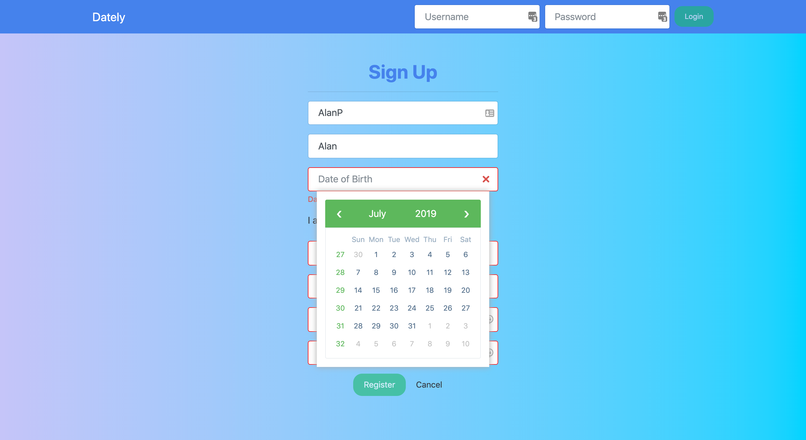
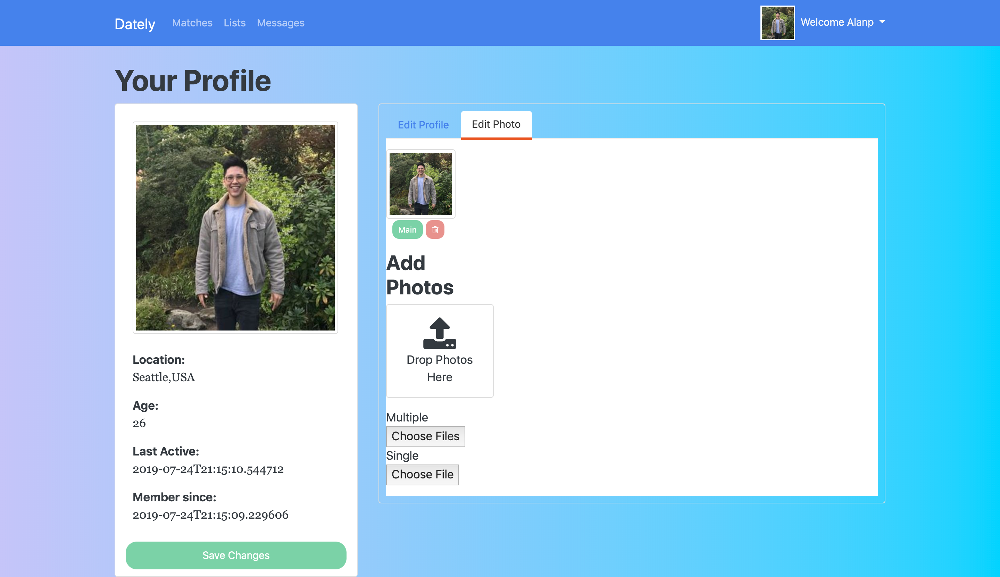
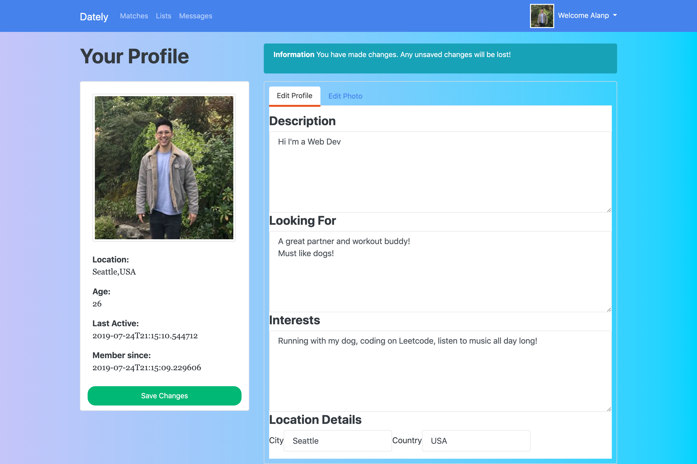

# Dately
A dating web application that utilizes Angular core as front end , Asp.net as backend 

DATELY
--------
/* REGISTER YOUR USERS */

/* Upload your profile pics */

/* Edit your profile */

/* View other profiles and message them and chat */

What the other users can do to you as well

/* Get Liked by someone else */

/* Get displayed in a matching system */

Tech Stack
-----------
-Angular(front end)
-ASP.NET w/ Entity Framework (backend)
-SQLite Development/ MySQL Production
-Bootstrap 

